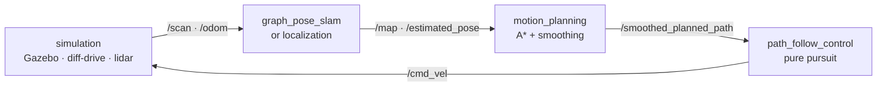

<div align="center">

# 🤖 taorobot

**A complete ROS 2 autonomous driving stack, from scratch — no Nav2, no SLAM Toolbox, no black boxes.**

[](https://docs.ros.org/en/humble/)
[](https://gazebosim.org/)
[](LICENSE)
[](CONTRIBUTING.md)

</div>

Mapping, localization, SLAM, planning, and control for a mobile robot in ROS 2
and Gazebo — **every algorithm implemented by hand**, in plain, readable nodes.
Most robotics tutorials hand you Nav2 and SLAM Toolbox as black boxes. This one
doesn't: read it, run it, break it, and actually understand how a robot thinks.

## Demo 1 — SLAM

Graph-pose SLAM, written from scratch, mapping a maze with only a lidar and a
noisy wheel encoder. Watch the map and trajectory snap into place on loop
closure:


```bash
ros2 launch simulation bringup_simulation.launch.py    # 1. simulation
ros2 run teleop_twist_keyboard teleop_twist_keyboard   # 2. teleop
ros2 launch bringup slam.launch.py                     # 3. SLAM + RViz
```

## Demo 2 — Localization

A particle filter finding the robot's true pose in a known map — and finding it
again after the robot is "kidnapped":


```bash
ros2 launch simulation bringup_simulation.launch.py    # 1. simulation
ros2 run teleop_twist_keyboard teleop_twist_keyboard   # 2. teleop
ros2 launch bringup localization.launch.py             # 3. map server + particle filter + RViz
```

The launch serves a saved SLAM-built map on `/map` (override with
`map:=/abs/path.yaml`) and starts the particle filter, which waits for an
initial guess — give it one with the **2D Pose Estimate** tool in RViz, then
drive around and watch the particles converge.

## Demo 3 — Navigation

Send a goal in RViz; the robot plans an A* path, smooths it, and drives it with
pure pursuit:


```bash
ros2 launch simulation bringup_simulation.launch.py   # 1. simulation
ros2 launch bringup navigation.launch.py              # 2. localization + planner + controller + RViz
```

The second launch brings up the whole stack (`map:=/abs/path.yaml` to swap
maps). Give the particle filter an initial guess with **2D Pose Estimate**,
then send a **2D Goal Pose** — the robot drives there.

> Run each command in its own terminal after building ([Quick Start](#quick-start)),
> with `source install/setup.bash` in each one. Every `bringup` launch opens a
> preconfigured RViz (skip with `use_rviz:=false`).

## How the stack fits together



The robot senses, figures out where it is, plans a path, and drives it — and
every box in that loop is a node you can open and read.

## Why not just use Nav2?

Nav2 and SLAM Toolbox are excellent production tools — and that's exactly why
they're hard to learn from. They're built to be *configured*, not *read*:
plugin interfaces, lifecycle managers, behavior trees, and parameters tuned by
folklore.

taorobot makes the opposite trade:

|                   | Nav2 / SLAM Toolbox                       | taorobot                          |
| ----------------- | ----------------------------------------- | --------------------------------- |
| Built for         | production robots                         | understanding                     |
| Architecture      | plugins, lifecycle managers, behavior trees | one plain ROS 2 node per algorithm |
| Size              | hundreds of thousands of lines            | **~12,000 lines — the whole stack** |
| When it misbehaves | tune YAML and hope                        | read the code, fix the math       |

To be clear: this is **not** a production replacement for Nav2. It's the stack
you study so that Nav2 stops being magic — or the starting point you fork when
Nav2 is more machinery than your robot needs. (The only borrowed piece left is
`nav2_map_server`, wrapped in a small launch file to serve saved maps;
replacing it is on the [roadmap](#roadmap).)

## Quick Start

ROS 2 Humble, Gazebo (classic), and `colcon`. The repository is itself a colcon
workspace — clone and build it directly:

```bash
git clone https://github.com/JinTTTT/taorobot.git
cd taorobot

# install dependencies (g2o, map server, ...)
rosdep install --from-paths src --ignore-src -y
sudo apt install ros-humble-teleop-twist-keyboard

colcon build --symlink-install
source install/setup.bash
```

## Packages

| Package | What's inside |
| ------- | ------------- |
| [`simulation`](src/simulation/) | Gazebo world, diff-drive robot, 2D lidar — publishes `/scan`, `/odom`, TF |
| [`mapping`](src/mapping/) | Occupancy-grid mapping: Bresenham ray-tracing + log-odds updates |
| [`localization`](src/localization/) | Particle-filter (Monte-Carlo) localization against a known map, publishing `map → odom` |
| [`graph_pose_slam`](src/graph_pose_slam/) | Keyframe pose-graph SLAM: correlative scan matching + g2o loop closure |
| [`slam_fastslam`](src/slam_fastslam/) | FastSLAM: every particle carries its own pose, trajectory, and map |
| [`motion_planning`](src/motion_planning/) | A* on an inflated grid + line-of-sight shortcutting + spline smoothing |
| [`path_follow_control`](src/path_follow_control/) | Pure-pursuit path follower publishing `/cmd_vel` |
| [`bringup`](src/bringup/) | Top-level launch files composing the stack, plus shared RViz views |

Each package has its own README with the full design and tuning notes.

## Roadmap

- **Recovery behaviors** — detect a stuck or lost robot during navigation,
  then replan, back off, or re-localize automatically.
- **Drop the last Nav2 dependency** — a minimal map-server node in `mapping`
  (load YAML + PGM, publish a latched `/map`) so the stack is 100% from scratch.
- **`graph_pose_slam` performance** — loop-closure search cost grows with the
  number of nearby keyframes; planned: spatial subsampling of candidates, a
  loop-closure cooldown, or an async loop-closure back-end.
- **A local planner** — reactive obstacle avoidance between the global plan
  and pure pursuit.

## Contributing

This is a learn-in-public project — questions, bug reports, doc fixes, and code
are all welcome. See [CONTRIBUTING.md](CONTRIBUTING.md).

## License

[MIT](LICENSE)
