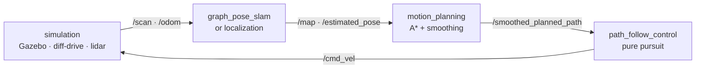

<div align="center">

# 🤖 taorobot

**A complete mobile-robot navigation stack, written from scratch — every layer, no black boxes.**

[](https://docs.ros.org/en/humble/)
[](https://gazebosim.org/)
[](LICENSE)
[](CONTRIBUTING.md)


*Graph-pose SLAM (written from scratch) mapping a maze — the map and trajectory
self-correct on every loop closure.*

</div>

Mapping, localization, SLAM, planning, and control for a mobile robot in ROS 2
and Gazebo — **every algorithm implemented by hand**, in plain, readable nodes.

Most robotics tutorials hand you Nav2 and SLAM Toolbox as black boxes. This one
doesn't. Every layer here is written from scratch so you can read it, run it,
break it, and actually understand how a robot thinks.

> 🎓 Built as a learn-in-public project. If you're learning robotics too,
> issues, questions, and pull requests are genuinely welcome.

## What you'll learn

- 🗺️ **Mapping** — build an occupancy grid with Bresenham ray-tracing + log-odds
- 📍 **Localization** — particle filter and Kalman filter, from the math up
- 🧭 **SLAM** — pose-graph SLAM with loop closure (plus a FastSLAM variant)
- 🛣️ **Planning** — A* global planner with obstacle inflation + path smoothing
- 🚗 **Control** — pure-pursuit path follower publishing `/cmd_vel`

## How the stack fits together



The robot senses, figures out where it is, plans a path, and drives it — and
every box in that loop is a node you can open and read. `mapping` builds the
maps the localizers use, and `slam_fastslam` is an alternative, particle-based
take on the SLAM box.

## Why not just use Nav2?

Nav2 and SLAM Toolbox are excellent production tools — and that's exactly why
they're hard to learn from. They're built to be *configured*, not *read*:
plugin interfaces, lifecycle managers, behavior trees, and parameters tuned by
folklore.

taorobot makes the opposite trade:

|                   | Nav2 / SLAM Toolbox                       | taorobot                          |
| ----------------- | ----------------------------------------- | --------------------------------- |
| Built for         | production robots                         | understanding                     |
| Architecture      | plugins, lifecycle managers, behavior trees | one plain ROS 2 node per algorithm |
| Size              | hundreds of thousands of lines            | **~12,000 lines — the whole stack** |
| When it misbehaves | tune YAML and hope                        | read the code, fix the math       |

To be clear: this is **not** a production replacement for Nav2. It's the stack
you study so that Nav2 stops being magic — or the starting point you fork when
Nav2 is more machinery than your robot needs. (The only borrowed piece left is
`nav2_map_server` for serving saved maps in two demos; replacing it is on the
[roadmap](#roadmap).)

## Quick Start

### Prerequisites

ROS 2 Humble, Gazebo (classic), and `colcon`.

### Build

The repository is itself a colcon workspace — clone and build it directly:

```bash
git clone https://github.com/JinTTTT/taorobot.git
cd taorobot

# install dependencies (g2o, map server, ...)
rosdep install --from-paths src --ignore-src -y
sudo apt install ros-humble-teleop-twist-keyboard ros-humble-nav2-util

colcon build --symlink-install
source install/setup.bash
```

Run each command in the demos below in its own terminal, and
`source install/setup.bash` in each one first. In RViz, set the
**Fixed Frame** to `map`.

## Demo 1 — Mapping

```bash
ros2 launch simulation bringup_simulation.launch.py    # 1. simulation
ros2 run teleop_twist_keyboard teleop_twist_keyboard   # 2. drive the robot around
ros2 run mapping occupancy_mapper_node                 # 3. mapper
rviz2                                                  # 4. add /map
```

Drive the robot around and watch the occupancy grid grow — the mapper needs the
robot to move to see the world.

## Demo 2 — Localization

```bash
ros2 launch simulation bringup_simulation.launch.py    # 1. simulation
ros2 run teleop_twist_keyboard teleop_twist_keyboard   # 2. teleop
# 3. publish the saved map:
ros2 run nav2_map_server map_server --ros-args -p yaml_filename:=src/mapping/maps/maze_map.yaml
ros2 run nav2_util lifecycle_bringup map_server
# 4. localization — run ONE of these:
ros2 run localization particle_filter_localization_node   # particle filter
ros2 run localization kalman_localization_node            # or Kalman filter
rviz2                                                  # 5. RViz
```

RViz: add `/map`, `/likelihood_field`, `/particlecloud`, `/estimated_pose`. The
localization node publishes `map → odom`, so don't run a static transform, and
don't run both localization nodes at once.


*The particle filter finding the robot's true pose in the maze — and recovering
it again after the robot is "kidnapped".*

## Demo 3 — SLAM

```bash
ros2 launch simulation bringup_simulation.launch.py    # 1. simulation
ros2 run teleop_twist_keyboard teleop_twist_keyboard   # 2. teleop
ros2 launch graph_pose_slam graph_pose_slam.launch.py  # 3. SLAM
rviz2                                                  # 4. RViz
```

RViz: add `/map`, `/poses_graph`, `/estimated_pose`, and `TF`. The map and
trajectory self-correct after each loop closure — this is the demo shown in the
GIF at the top of this page.

## Demo 4 — Motion Planning and Control

```bash
ros2 launch simulation bringup_simulation.launch.py    # 1. simulation
# 2. static map server:
ros2 run nav2_map_server map_server --ros-args -p yaml_filename:=src/mapping/maps/maze_map.yaml
ros2 run nav2_util lifecycle_bringup map_server
# 3. localization (particle filter or Kalman):
ros2 launch localization particle_filter_localization.launch.py
# 4. planning + control:
ros2 launch motion_planning motion_planning.launch.py
ros2 launch path_follow_control path_follow_control.launch.py
rviz2                                                  # 5. RViz
```

RViz: add `/map`, `/inflated_map`, `/planned_path`, `/smoothed_planned_path`,
`/lookahead_point`, then use the **2D Goal Pose** tool to send a goal with a
final heading — the robot plans a path and drives it.

## Packages

Each package has its own README with the full design. Short version:

### `simulation`

Starts the robot in Gazebo with differential drive and a 2D lidar. Publishes
odometry on `/odom`, laser scans on `/scan`, and the robot TF tree. Drive it with
keyboard teleop on `/cmd_vel`.

### `mapping`

Builds an occupancy grid from `/scan` and the `odom → base_link` TF, publishing
`/map`. Each laser beam is ray-traced with Bresenham and the cells updated with
log-odds: cells along a beam become more likely free, the hit cell more likely
occupied, and repeated scans make the map more confident. Odometry is used only
as a rough pose guess.

### `localization`

Localizes against a saved occupancy grid using two approaches.

**Particle filter** — reads `/map`, `/odom`, `/scan`; publishes `/particlecloud`,
`/likelihood_field`, `/estimated_pose`, and the `map → odom` TF. It spreads
particles on free cells, scores them against a likelihood field, moves them with
noisy odometry, and resamples after each scan — injecting recovery particles when
the best score drops. The estimate comes from the best-weighted particles, not
the whole cloud.

**Kalman filter** — assumes a known start pose of `0, 0, 0`; reads `/map`,
`/odom`, `/scan`; publishes `/estimated_pose`, `/estimated_pose_with_covariance`,
`/scan_matched_pose`, and `map → odom`. A scan-matched pose corrects the filter
when score and distance gates pass. It is a local tracker, so large odometry
errors can lose the true pose.

### `graph_pose_slam`

Graph-based pose SLAM. Reads `/odom` and `/scan`; publishes `/map`,
`/poses_graph`, `/estimated_pose`, and `map → odom`. It keeps a keyframe every
fixed translation, matches each scan against a stitched local map with a
coarse-to-fine correlative scan matcher, and adds odometry and scan-match edges to
a pose graph. On a loop closure, g2o optimizes the whole graph at once and the
occupancy map is rebuilt from the corrected poses. See
[`src/graph_pose_slam/README.md`](src/graph_pose_slam/README.md) for the full design.

### `slam_fastslam`

Particle-based (FastSLAM) SLAM. Each particle carries its own pose, trajectory,
occupancy map, and likelihood field; the node publishes the selected particle's
map, path, and pose plus the full cloud. See
[`src/slam_fastslam/README.md`](src/slam_fastslam/README.md).

### `motion_planning`

Global path planner. Reads `/map`, `/estimated_pose`, `/goal_pose`; publishes
`/planned_path`, `/smoothed_planned_path`, `/inflated_map`. It inflates obstacles
by the robot radius, runs A* on an 8-connected grid, then smooths the path with
line-of-sight shortcutting and cubic-spline fitting, resampling so the final path
stays dense. Unknown cells are treated as blocked. Global planning only — no local
planner yet. Tuning: `src/motion_planning/config/motion_planning.yaml`.

### `path_follow_control`

Pure-pursuit path follower. Reads `/smoothed_planned_path` and `/estimated_pose`;
publishes `/cmd_vel`. It rotates in place when heading error is large, computes
curvature from the lookahead point (`w = v * curvature`), slows on sharp turns and
near the goal, then rotates to the final goal heading. Planning and control stay
separate: `motion_planning` chooses where to go, this decides how to move now.
Tuning: `src/path_follow_control/config/path_follow_control.yaml`.

## Roadmap

- **Navigation** — tie localization, planning, and control into one
  goal-to-goal navigation bringup with recovery behaviors. In progress.
- **Drop the last Nav2 dependency** — a minimal map-server node in `mapping`
  (load YAML + PGM, publish a latched `/map`) so the stack is 100% from scratch.
- **`graph_pose_slam` performance** — loop-closure search cost grows with the
  number of nearby keyframes, so it can slow down in heavily revisited areas.
  Planned: spatial subsampling of candidates, a loop-closure cooldown, or an
  async loop-closure back-end.
- **A local planner** — reactive obstacle avoidance between the global plan
  and pure pursuit.

## Contributing

This is a learn-in-public project — questions, bug reports, doc fixes, and code
are all welcome. See [CONTRIBUTING.md](CONTRIBUTING.md).

## License

[MIT](LICENSE)
