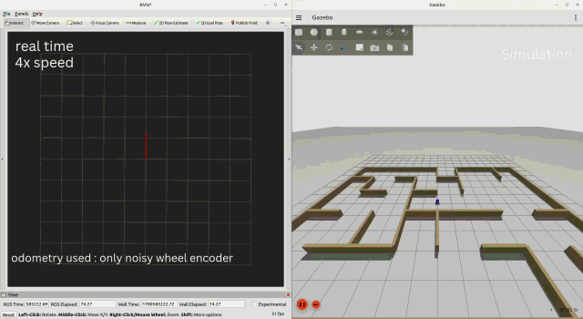
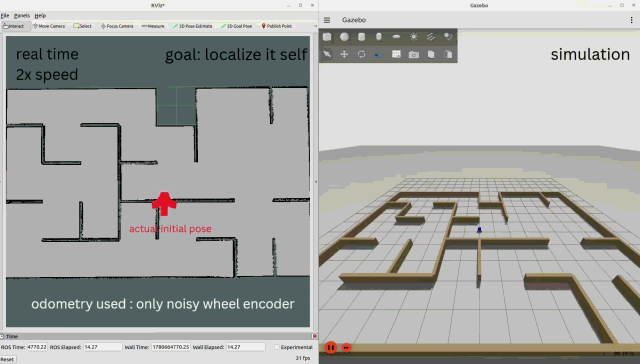
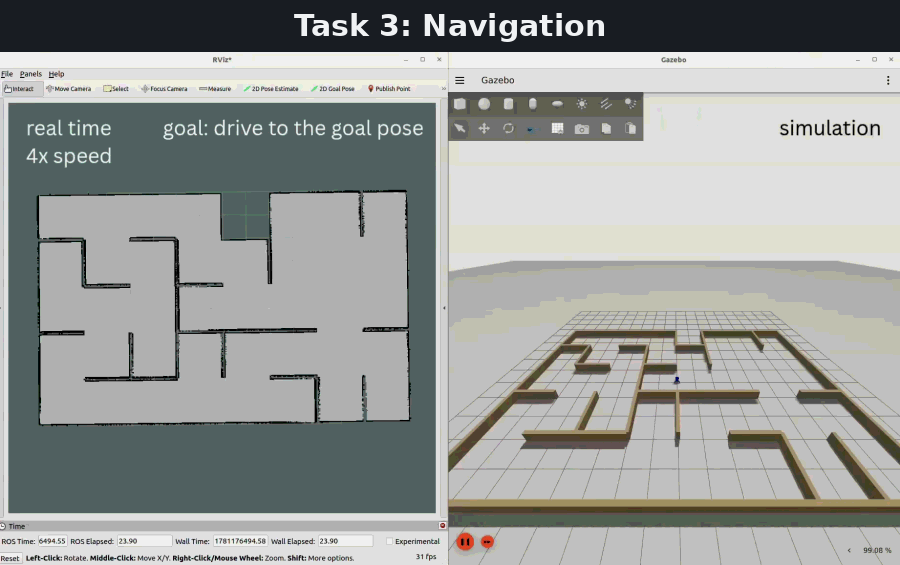
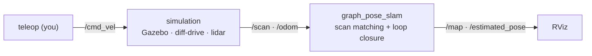
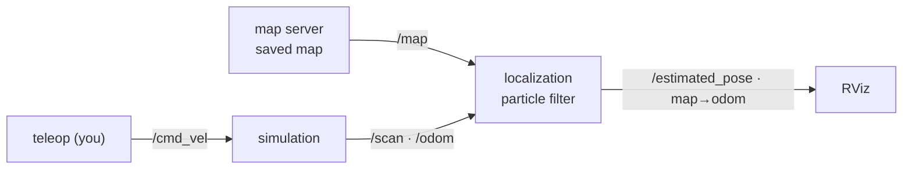
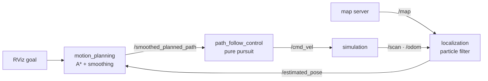

<div align="center">

# 🤖 taorobot

**A complete ROS 2 autonomous driving stack, from scratch — no Nav2, no SLAM Toolbox, no black boxes.**

[](https://github.com/JinTTTT/taorobot/actions/workflows/ci.yml)
[](https://docs.ros.org/en/humble/)
[](https://gazebosim.org/)
[](LICENSE)
[](CONTRIBUTING.md)

</div>

Mapping, localization, SLAM, planning, and control for a mobile robot in ROS 2
and Gazebo — **every algorithm implemented by hand**, in plain, readable nodes.
Most robotics tutorials hand you Nav2 and SLAM Toolbox as black boxes. This one
doesn't: read it, run it, break it, and actually understand how a robot thinks.

> **To run the demos:** build the workspace first ([Quick Start](#quick-start)),
> then run each command in its own terminal with `source install/setup.bash`.
> Every `bringup` launch opens a preconfigured RViz (skip with `use_rviz:=false`).

## Demo 1 — SLAM

Graph-pose SLAM, written from scratch, mapping a maze with only a lidar and a
noisy wheel encoder. Watch the map and trajectory snap into place on loop
closure:



```bash
ros2 launch simulation bringup_simulation.launch.py    # 1. simulation
ros2 run teleop_twist_keyboard teleop_twist_keyboard   # 2. teleop
ros2 launch bringup slam.launch.py                     # 3. SLAM + RViz
```

## Demo 2 — Localization

A particle filter finding the robot's true pose in a known map — and finding it
again after the wheel odometry is corrupted by driving the robot against a wall:



```bash
ros2 launch simulation bringup_simulation.launch.py    # 1. simulation
ros2 run teleop_twist_keyboard teleop_twist_keyboard   # 2. teleop
ros2 launch bringup localization.launch.py             # 3. map server + particle filter + RViz
```

The launch serves a saved SLAM-built map on `/map` (override with
`map:=/abs/path.yaml`) and starts the particle filter, which waits for an
initial guess — give it one with the **2D Pose Estimate** tool in RViz, then
drive around and watch the particles converge.

## Demo 3 — Navigation

Send a goal in RViz; the robot plans an A* path, smooths it, and drives it with
pure pursuit:



```bash
ros2 launch simulation bringup_simulation.launch.py   # 1. simulation
ros2 launch bringup navigation.launch.py              # 2. localization + planner + controller + RViz
```

The second launch brings up the whole stack (`map:=/abs/path.yaml` to swap
maps). Give the particle filter an initial guess with **2D Pose Estimate**,
then send a **2D Goal Pose** — the robot drives there.

## How the stack fits together

The three demos are the same stack with more pieces switched on, in the
classic learning order: first the map is unknown (SLAM), then the map is known
but the pose isn't (localization), then the robot uses both to drive itself
(navigation).

**Demo 1 — SLAM.** You drive; the robot builds the map and tracks its own pose
in it:



**Demo 2 — Localization.** You drive; the map is already known (saved from
Demo 1), and a particle filter works out where the robot is in it:



**Demo 3 — Navigation.** Nobody drives. Localization feeds the planner, the
planner feeds the controller, the controller moves the robot — the loop closes:



Every box in these diagrams is a plain ROS 2 node in this repo that you can
open and read.

## Why not just use Nav2?

Nav2 and SLAM Toolbox are excellent production tools — and that's exactly why
they're hard to learn from. Production-grade means they have to work for every
robot shape, sensor setup, and edge case, which brings heavy machinery: plugin
interfaces, lifecycle managers, behavior trees, costmap layers, and a long
dependency list. All of that makes them hard to read and even harder to
change — they're built to be *configured*, not *understood*. And configuring
is a job of its own: a typical Nav2 bringup has hundreds of parameters, tuned
mostly by folklore.

taorobot makes the opposite trade:

|                   | Nav2 / SLAM Toolbox                       | taorobot                          |
| ----------------- | ----------------------------------------- | --------------------------------- |
| Built for         | production robots                         | understanding                     |
| Architecture      | plugins, lifecycle managers, behavior trees | one plain ROS 2 node per algorithm |
| Size              | hundreds of thousands of lines, many dependencies | **~12,000 lines — the whole stack** |
| Parameters        | hundreds, spread across plugin namespaces | **~110**, in seven short YAML files with the reasoning in comments |
| When it misbehaves | tune YAML and hope                        | read the code, fix the math       |

To be clear: this is **not** a production replacement for Nav2. It's the stack
you study so that Nav2 stops being magic — or the starting point you fork when
Nav2 is more machinery than your robot needs. (The only borrowed piece left is
`nav2_map_server`, wrapped in a small launch file to serve saved maps; a
from-scratch replacement is planned.)

## Quick Start

Tested on Ubuntu 22.04 with [ROS 2 Humble](https://docs.ros.org/en/humble/Installation.html).
The simulator is the modern **Gazebo Sim** (Fortress, via `ros_gz`) — *not*
Gazebo Classic — and `rosdep` below installs it for you. The repository is
itself a colcon workspace — clone and build it directly:

```bash
git clone https://github.com/JinTTTT/taorobot.git
cd taorobot

# install dependencies (Gazebo Sim + ros_gz bridge, g2o, map server, ...)
rosdep install --from-paths src --ignore-src -y
sudo apt install ros-humble-teleop-twist-keyboard

colcon build --symlink-install
source install/setup.bash
```

## Packages

| Package | What's inside |
| ------- | ------------- |
| [`simulation`](src/simulation/) | Gazebo world, diff-drive robot, 2D lidar — publishes `/scan`, `/odom`, TF |
| [`mapping`](src/mapping/) | Occupancy-grid mapping: Bresenham ray-tracing + log-odds updates |
| [`localization`](src/localization/) | Particle-filter (Monte-Carlo) localization against a known map, publishing `map → odom` |
| [`graph_pose_slam`](src/graph_pose_slam/) | Keyframe pose-graph SLAM: correlative scan matching + g2o loop closure |
| [`slam_fastslam`](src/slam_fastslam/) | FastSLAM: every particle carries its own pose, trajectory, and map |
| [`motion_planning`](src/motion_planning/) | A* on an inflated grid + line-of-sight shortcutting + spline smoothing |
| [`path_follow_control`](src/path_follow_control/) | Pure-pursuit path follower publishing `/cmd_vel` |
| [`bringup`](src/bringup/) | Top-level launch files composing the stack, plus shared RViz views |

Each package has its own README with the full design and tuning notes.

## What you'll learn

Each package is a from-scratch implementation of one classic robotics
technique — reading them in this order is a curriculum:

| Concept | Where to read it |
| ------- | ---------------- |
| Odometry noise modeling — Thrun's velocity motion model, why perfect odometry teaches nothing | [`simulation`](src/simulation/) |
| Occupancy-grid mapping — Bresenham ray tracing, log-odds cell updates | [`mapping`](src/mapping/) |
| Particle-filter localization — likelihood fields, low-variance resampling, kidnap recovery | [`localization`](src/localization/) |
| Pose-graph SLAM — correlative scan matching, loop closure, g2o graph optimization | [`graph_pose_slam`](src/graph_pose_slam/) |
| FastSLAM — Rao-Blackwellized particles, every particle carries its own map | [`slam_fastslam`](src/slam_fastslam/) |
| A* global planning — obstacle inflation, line-of-sight shortcutting, spline smoothing | [`motion_planning`](src/motion_planning/) |
| Pure-pursuit control — lookahead tracking, rotate-in-place recovery, stuck detection | [`path_follow_control`](src/path_follow_control/) |
| TF frame conventions — who publishes `map → odom → base_link`, and why | every README above |

## Contributing

This is a learn-in-public project — questions, bug reports, doc fixes, and code
are all welcome. See [CONTRIBUTING.md](CONTRIBUTING.md).

## License

[MIT](LICENSE)
